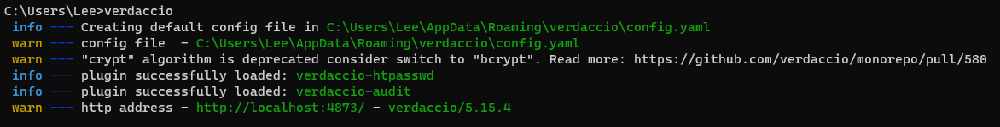
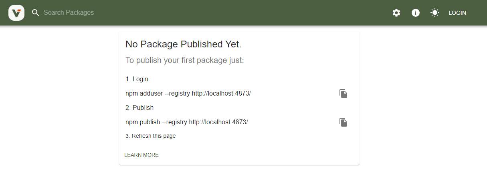
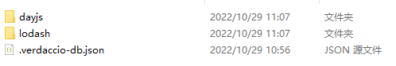
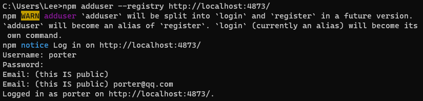
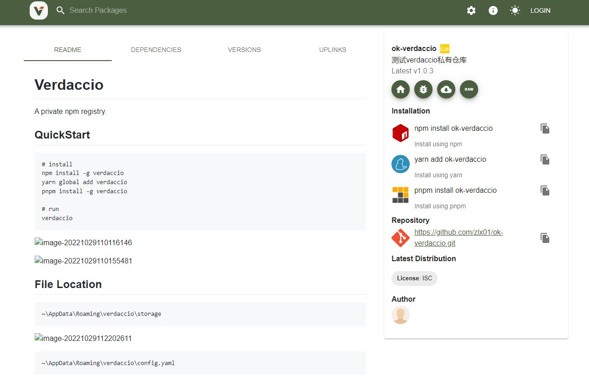

# [Verdaccio](https://verdaccio.org/)

A private npm registry.

## QuickStart

```bash
# install
npm install -g verdaccio
yarn global add verdaccio
pnpm install -g verdaccio

# run
verdaccio
```





## File Location


```bash
~\AppData\Roaming\verdaccio\storage
```




```bash
~\AppData\Roaming\verdaccio\config.yaml
```


## Docker image

```bash
docker run -it --rm --name verdaccio -p 4873:4873 verdaccio/verdaccio
```


## Custom Registry

### User

```bash
# 会在用户目录生成 `.npmrc` 文件
npm set registry http://localhost:4873
# 会在用户目录生成 `.yarnrc` 文件
yarn config set registry http://localhost:4873
```

`npm` `yarn`  `pnpm` 都能识别 `.npmrc`

#### .npmrc

```.npmrc
registry=http://localhost:4873/
```

####  .yarnrc

```.yarnrc
registry "http://localhost:4873"
```

### Project

```bash
# 会在项目根目录生成 `.npmrc` 文件
npm set registry http://localhost:4873/ --location project
```
### CLI

```bash
npm install lodash --registry http://localhost:4873
yarn add dayjs --registry http://localhost:4873
```

## Login & Publish

```bash
# 1. Login
npm adduser --registry http://localhost:4873/

npm whoami

# 2. Publish
npm publish --registry http://localhost:4873/
```

### adduser




### prevent your package from being published in other registries

在 `package.json` 配置

```json
{
  "publishConfig": {
    "registry": "http://localhost:4873"
  }
}
```

直接publish

```bash
npm publish
```




两个问题：

1. README不是跟随版本的，展示最新的。
2. README中的图片引用失败。


## unpublish

```bash
npm unpublish ok-verdaccio@1.0.5
```